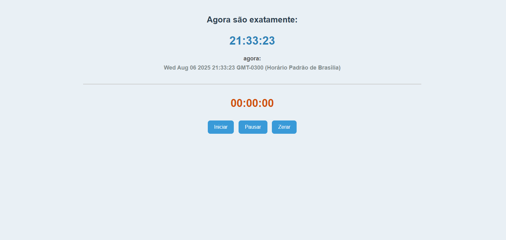

# Controle de Tempo Digital

Uma aplicação web simples e elegante para visualização do tempo atual e controle de cronometragem, construída com tecnologias web fundamentais.

[Badge de Status]([https://web-21052025.vercel.app/])


<a href="demonstração.mp4" title="Clique para ver o vídeo">
  
</a>

## :wrench: Funcionalidades

* **Relógio em Tempo Real:** Exibe a hora, minutos e segundos atuais, sincronizados com o relógio do sistema e atualizados a cada segundo.
* **Cronômetro Completo:**
    * **Iniciar:** Começa a contagem do tempo.
    * **Pausar / Retomar:** Permite pausar a contagem e retomá-la do ponto onde parou.
    * **Zerar:** Interrompe a contagem e reinicia o cronômetro para 00:00:00.

## :hammer_and_wrench: Tecnologias Utilizadas

Os seguintes materiais de construção foram empregados nesta obra:
* **HTML5 Semântico**
* **CSS3** com um design limpo e responsivo.
* **JavaScript (ES6+)** para toda a lógica de funcionamento do relógio e cronômetro.
* **Google Fonts** para a tipografia `Orbitron`, que confere um visual digital ao projeto.

## :construction_worker: Como Rodar o Projeto

Para executar esta aplicação em sua máquina local, siga os passos abaixo:

1. **Clone o repositório:**
   ```bash
   git clone [https://github.com/Thiagops5/Painel-de-Controle-de-Tempo.git](https://github.com/Thiagops5/Painel-de-Controle-de-Tempo.git)

<a href="https://www.google.com/search?q=https://github.com/thiagops5">

<br />
<sub><b>Thiago Pacheco</b></sub></a> <a href="https://www.linkedin.com/in/thiago-pacheco-tech/" title="LinkedIn"></a>
<br />
